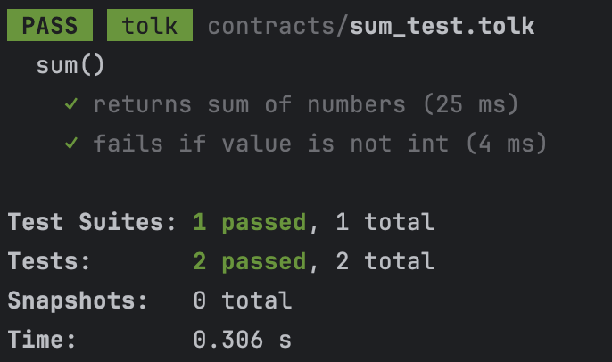

<p align="center">
  <picture>
    <source media="(prefers-color-scheme: dark)" srcset="https://raw.githubusercontent.com/tonkite/tonkite/main/assets/logo-dark.svg">
    
  </picture>
</p>

<p align="center">
  <a href="https://ton.org"></a>
  <a href="https://github.com/tonkite/tonkite"></a>
  <a href="https://t.me/tonkite"></a>
  <a href="https://opensource.org/licenses/Apache-2.0"></a>
</p>

---

# Jest Runner for Tolk

A Jest runner that enables you to write and execute unit tests for Tolk code using familiar testing patterns.

## Example

Consider a simple Tolk function in `sum.tolk`:

```kotlin
fun calculateSum(a: int, b: int) {
    return a + b;
}
```

You can write unit tests for this function using Tolk:

```kotlin
import "../node_modules/@tonkite/jest-tolk/testing.tolk"
import "sum.tolk"

// @scope sum()
get test_returns_sum_of_numbers() {
    val a: int = 4;
    val b: int = 7;

    assert(calculateSum(a, b) == a + b) throw 100;
}

fun cast<T, X>(value: X): T asm "NOP";

// @scope sum()
get test_fails_if_value_is_not_int() {
    test.expectExitCode(7); // type check error

    val a: int = cast<int>(null);
    val b: int = 7;

    calculateSum(a, b);
}
```

Test result:



## Installation

1. Install `@tonkite/jest-tolk`:
   ```shell
   pnpm add -D @tonkite/jest-tolk
   ```
2. Add runner configuration to `jest.config.ts`:

   ```typescript
   import type { Config } from 'jest';

   const config: Config = {
     projects: [
       {
         displayName: 'test',
         preset: 'ts-jest',
         testEnvironment: 'node',
         testPathIgnorePatterns: ['/node_modules/', '/dist/'],
       },
       {
         displayName: 'tolk',
         moduleFileExtensions: ['tolk'],
         testMatch: ['**/*[._]test.tolk'],
         runner: '@tonkite/jest-tolk',
       },
     ],
   };

   export default config;
   ```

## Fuzzing

The Runner comes with native fuzz-testing support. For every fuzz test (starting from `testFuzz_`) it:

1. Generates random values for each argument.

2. Executes the test repeatedly (default 100 runs).

3. Stops on the first failure and prints the failing inputs.

Adjust the iteration count with the `@runs` annotation.

### Fuzz-able types

- Signed and unsigned integers of any width — `int`, `int8`, `uint231`, etc.
(`bool` is treated as a one-bit unsigned int).
- `address` (including `addr_std`, `addr_extern` and `addr_none`)

### Example:

```kotlin
fun div(x: int, y: int): int
    asm "DIV";

/** @runs 1000 */
get testFuzz_div(x: int8, y: uint16) {
    if (y == 0) {
        test.expectExitCode(4); // division by zero
    }

    Assert.equal(x / y, div(x, y));
}
```

## Annotations

The runner allows you to configure the behavior of tests using special annotations in comments.

### Example:

```kotlin
/**
 * @scope examples
 */
get test_fail_with_exit_code_500() {
    test.expectExitCode(500);
    throw 500;
}
```

### Supported Annotations:

| Annotation              | Example                  | Description                                                                            |
|:------------------------|:-------------------------|:---------------------------------------------------------------------------------------|
| `@scope [scope]`        | `// @scope Pool::onSwap` | Specifies the scope of a test (useful for test grouping).                              |
| `@skip`                 | `// @skip`               | Marks a test to be skipped.                                                            |
| `@todo`                 | `// @todo`               | Marks a test to be done later.                                                         |
| `@gasLimit [gas limit]` | `// @gasLimit 50000`     | Sets a gas limit for a test. Default: `10000`.                                         |
| `@runs [runs]`          | `// @runs 1000`          | Sets a number of iterations for fuzzing. Default: `100`.                               |
| `@no-main`              | `// @no-main`            | Disables adding an entrypoint `fun main() {}` to avoid collision with an existing one. |

## License

<a href="https://opensource.org/licenses/Apache-2.0"></a>
